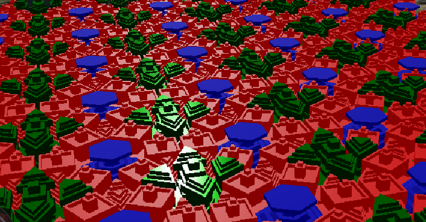

## Tower Tilings (2022)

A 2D tesselation extruded to 3D that looks like a collection of towers (or perhaps chess pieces?).

:warning: ARCHIVED - Due to a Assignment of Inventions Agreement I signed when I started working at Cesium, this copyright for this project was assigned to my employer Cesium GS, Inc. This project is still open-source under the Apache 2.0 license. However, I choose not to maintain this repo anymore, and have archived it.



## Background

I had found the neat paper ["An integer representation for periodic tilings of the plane by regular polygons"](https://reality.cs.ucl.ac.uk/projects/tilings/sotosanchez2021integer.pdf)
by Soto Sánchez et al. I wanted to do something interesting
with it, so I thought to extrude the tiles into 3D. Instead
of just extruding into prisms, I extrude along a profile
defined in the config file.

This project also let me learn more about half-edge
meshes

## Usage

This project is hard-coded to produce a single tiling.
Just run

```
cargo run
```

This generates `output/test-base.obj` and `output/test-towers.glb`. The former is just the 2D tiling of the base of each
tile (no extrusion). The GLB model is a mesh with the extruded geometry. The mesh is instanced many times to show how it
repeats in a tessellation.