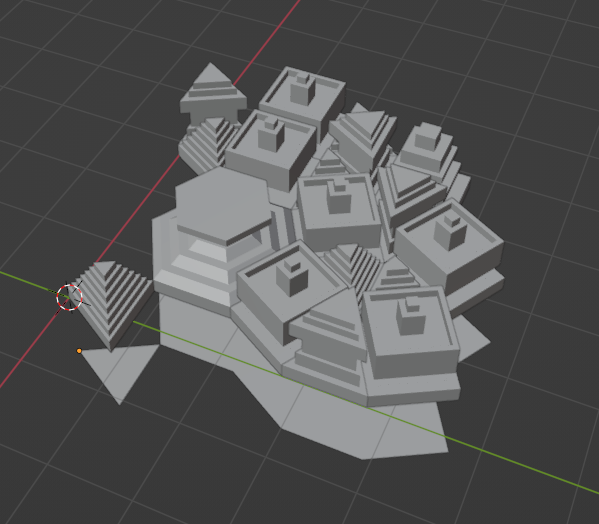
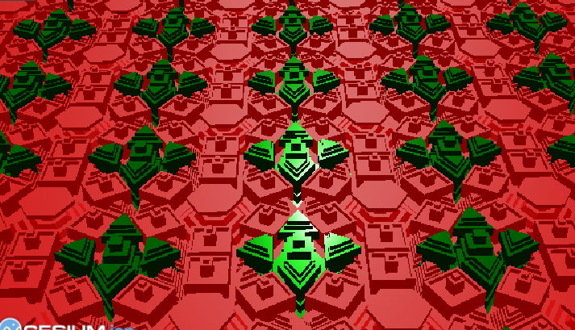

# Integer Tilings

## 2022-06-02 Prototyping tower generation

I actually haven't started making integer tilings yet,
I wanted to prototype a tile extrusion idea I had.
Basicallye each type of tile will be extruded into towers,
each with a potentially different "profille". A profile
is kinda like a path for generating a solid of revolution,
though in this case it's only applied at the vertices of
an n-gon where n will be between 3 and 12 in most cases.

Next Steps:

* Make the face insertion methods more robust, right now
the mesh is leaving behind old faces that are no longer used.
* Make a Vec3 class instead of using tuples
* Generate a whole tiling of towers!
* Make glTF output (which will require triangulation)

## 2022-06-03 Prototyping Integer Tiling implementation

Today I worked on implementing the integer tiling from
["An integer representation for periodic tilings of the plane by regular polygons"](https://reality.cs.ucl.ac.uk/projects/tilings/sotosanchez2021integer.pdf)
by Soto Sánchez et al. I generate faces from the representation as a `Mesh`
that will eventually be turned into tilings. However, right now it's only
producing some of the faces correctly, so I have some debugging to do in my
near future

Next Steps:

* Debug the mesh generation

## 2022-06-04 Tiling of Towers

Today I debugged the integer tiling code, and combined it with the tower
extrusion code to make a bunch of towers that fit together in a tiling.

Next Steps:

* Instead of saving many disjoint models, generate one GLB file with multiple
    primitives
* Also use the glTF extension EXT_mesh_gpu_instancing to make many copies of
    the fundamental domain
* Color each tower a different color! or otherwise adjust material properties
* Design more tilings!
* Clean up the extrusion code so it doesn't create extraneous faces

## 2022-06-09 WIP on GLB Output

The next step is creating GLB output. This is a bit involved given all the
levels of indirection, but so far I think the architecture is starting to
fall in place.

I add a primitive, which in turn adds accessors for each attribute/indices,
which in turn add buffer views. The geometry data is reformatted as `Vec<u8>`
and moved into one big buffer, but the indices are saved in structs for
generating the JSON.

I still have a couple portions of this code to go: triangulating the mesh
to produce the positions/normals/indices, and writing the GLB file. And of
course the inevitable debugging of the GLB output, binary formats are difficult
to get right on the first try

Next Steps:

* Finish GLB output as described above
* I designed some tilings on paper, try them out
* Clean up extrusion code

## 2022-06-10 Still WIP

Today I continued to work on the GLB output. I have it producing a GLB
file, though there's still some debugging. The glTF validator says there
are normals that are not unit length or have NaNs. I have some debugging to
do this weekend then.

## 2022-06-10 Fix one bug, find another

Today I figured out the NaN problem (I was packing vectors as f64 when it should
be f32), but now the position min/max is off. Also, when I view the results in
a glTF viewer, everything is squashed like a pancake instead of being a tower
shape.

## 2022-07-04 It's working!

Today I fixed the bugs. Turns out my triangulation wasn't correctly computing
indices, but I fixed it.

I'm not sure which glTF viewers out there support `EXT_mesh_gpu_instancing`
so for starters I tried rendering it in CesiumJS with 

[this sandcastle](https://sandcastle.cesium.com/#c=tVZtc+I2EP4rGj5BB2QbCBDKZcqRXHqdyzQT6LVzdaej2AJrIkseSSaknfz3riXbOIHrtcmED0byvj27+3ilSApt0JbRe6rQOyToPVpQzfIUf7bv2mErsvuFFIYwQVXY6qK/Q4GQTmTO47lgKTF0iozKaTcUj53vQxEK5xFHXEZ3OMqVosKsWEohRun/p5wzIs7BFq+VTD9qORn5QbvwHLb6fj/oBUHPP131/Wl/PB2MsR+M/NFwOD4ZDCejyfB0MP4StkLh4nkeupIx5ToUkU0ptTsI93vh0QJGyNCdmYJ7BwG9J5xLKSAjJwZDymkEKutcRIZJgdqdyhYStkIbpl29K8AmxmRTz4NUCU+kNtOJP/E9Q7XpGQlV0HjDb+sgxS84qdYF+uL/0Urd8xnY5R0TgsZokRBFImM78Cq8GHtLkmacQvGJ5wrluZJcEVGu/oTlAW7/f8A+B7ASLWSaKao14LdA3gS7DbWPVOXC+N1K5cC/DTfrF+fxi+DMoPdy9yLoxwGDN+u2XlQQkf+fKisFfUMSWP/N9ev4e6lkLmL0mSYs4m+D24UoIzzdvYrDH2GSEBEBeV/a/28hB791kCebQ9L+W9H/sEPQTb4kezbJf6QkZmJzzUyU3EjuUJWyK2ISbOQNaBCh28HE71invnu68er8rtmOxh8USelKge5aqnQ/zetXGts56PTkh9rmksLZQYxU5YQXUpmkzC9s3cOw3A/zuqzNUuaKd1FC2SYxZbEdrExqZpVrLAuiYPhCPgN7spzTjaJUl73oBf0B9sfD4Sg4LYs7HGL/xB+M/VH5wkUp1g4PKg9IrCPIAmeKpRBySzVWNJVbOoeaup40zh7A8zUrEsclmqoLhcHFLqOgAwcl4Rb4JTCgXdMK8p8Wj5oRNgr0T7Hd9EgbkmddbzajwcuqfA2iAYEau9LzBecs05LF+NfL5WTYUDjCi5qotVqezXdM1ziLDf5SS8Hmnqj4UOW3fbYMLhp5eg3B+JL9BReOoD/ZS8mukC6BeSDp+/ArZY+dZh9tzaBrJH64hgozTbFJqGjvP2SrUX/N1TUGklMEmC3v5qYu3kHpvvbNEbFplvz4pzc86XS/pdMLnii5bG6LaQexlllCFcUKdHONvkP7ceEWVQ0qO7hLABvd/Q2ysLQsmFwzDtLNpk8oWit/AhG+ubi+mK/qOtsPwP49FoGWRMQR0QZGMDheSclvibqiIncl1g5Oq9uaafPA6VkV9QeWZjAbCqq3YWQaCiMTLonau4WjnBocaV3Nv5nXNJ3FbItY/O7IjRVFnGgNknXOLXvC1tnMA/0DUy5t337eUsXJQ6GWBGef3EuM8cyD7XFL4zJ85vkf). Though I should see if Three.js
or other libraries support it.

The results look pretty cool!

